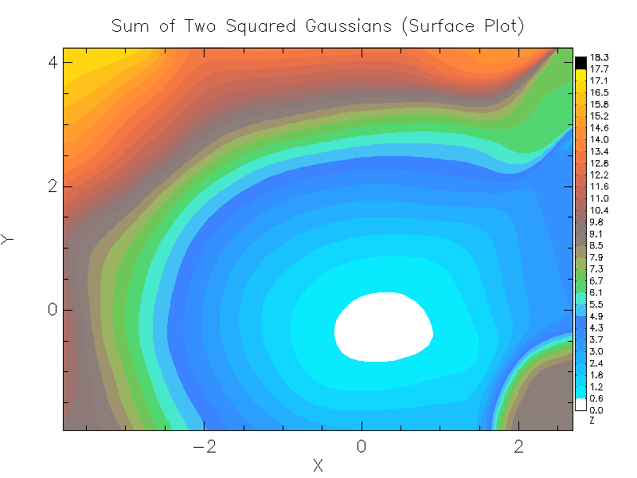

# model-vis
Tooling to visualize outputs of data models, in OCaml.



## Introduction
This library is a very early prototype to ease visualization of models trained from data, in OCaml. 
It aims to automatically generate good plots for your models given their specific features and outputs, 
with little to no tuning parameters required.

## Requirements
 - plplot
 - oml
 - gpr (optional, for plotting integration)


## Installation

Clone the repository and from the working directory run

```opam pin -y add .```

## Usage

The abstraction rests on a data frame type of interface, like you'd see in R, 
but done in an OCaml style to minimize explicit array indexing in user space.

Data for plotting is driven by consuming generators or parsing csv files, but
safely within the typed frame.

Some default generators are provided which will sample reasonable values base on 
user declared ranges or sets of points. 

In the case where only test data is given, the models are integrated into the process to provide output values. At the 
moment only the gaussian process regression model is supported, but the intention is 
to add tensorflow and oml to the list.

Please view the examples package for more details, which generates a surface plot of the squared sum of two gaussianly distributed values.
